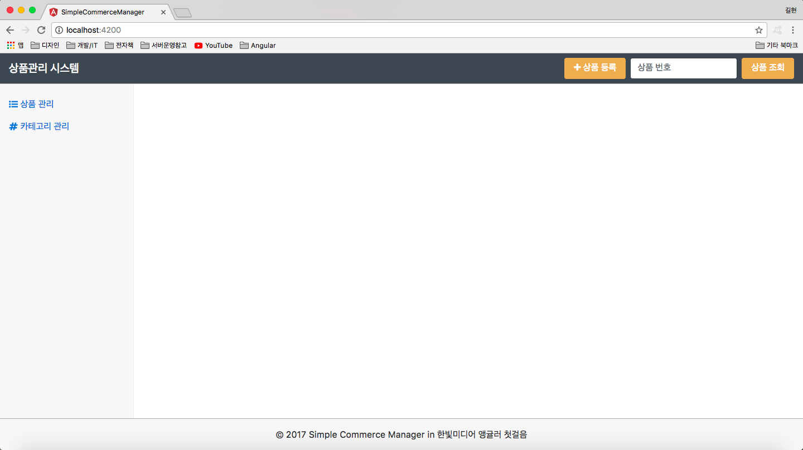

# CH.10 프로젝트: 상품 관리 애플리케이션 구성


### 10.1 애플리케이션 설계

예제 프로젝트는 Simple Commerce Manager라고 정의하고, SCM으로 부른다.


#### 10.1.1 기능 정의 및 도메인 모델

SCM은 기본적인 상품 정보(product)와 상품을 분류할 카테고리(category)를 등록/수정하는 기능을 제공


* ScmBase : 모든 모델이 공유할 기본속성
* Product : 상품판매에 필요한 최소한의 상품정보
* Category : 상품분류 카테고리


#### 10.1.2 컴포넌트 트리

SCM에서는 부트스트랩에서 제공하는 샘플 중 대시보드 예제 UI를 기반으로 뷰를 점진적으로 구성해 나감.


[그림10-2]의 레이이아웃과 기능 정의에 작성된 내용을 바탕으로 SCM에 필요한 뷰를 다음과 같이 도출함

* 전체 레이아웃: 상단 네비게이션, 왼쪽 사이드바, 하단 푸터 뷰
* 메인 페이지 : 애플리케이션 최초 진입 시 보여 줄 뷰 페이지
* 상품관리 : 등록된 상품 목록 및 상품 상세 뷰
* 카테고리 관리 : 카테고리 목록 및 상세 뷰

##### 전체 컴포넌트 트리


### 10.2 프로젝트 구성

프로젝트를 생성

```
ng new simple-commerce-nanager --prefix scm
```


부트스트랩4와 유용한 아이콘 모음을 제공하는 Font Awesome 패키지 추가

```
npm i --save bootstrap@4.0.0-alpah.6 font-awesome
```


.angular-cli.json에 부트스트랩, Font Awesome 패키지 추가

```typescript
{
  ...
  "apps": {
    ...
    "styles": [
       "../node_modules/bootstrap/dist/css/bootstrap.css",
       "../node_modules/font-awesome/css/font-awesome.css",
       "styles.css"
    ],
    "scripts": [
        "../node_modules/jquery/dist/jquery.js",
        "../node_modules/tether/dist/js/tether.js",
        "../node_modules/bootstrap/dist/js/bootstrap.js"
    ],
  }
}
```

변경내역 확인 : http://bit.ly/hb-af-final-start


### 10.3 프로젝트 구현 1: 기본 레이아웃 구현

전체소스 : git을 사용하여 final-2태그를 체크아웃 또는 http://bit.ly/hb-af-final-2를 통해서 변경 내역을 확인

> 실습소스를 10장 디렉토리에 저장. 

기본 레이아웃 구현화면


#### 10.3.1 주요 컴포넌트 생성

```
ng g component navbar
ng g component sidebar
ng g component footer
```


app.component.html 작성

```html
<scm-navbar></scm-navbar>
<div class="container-fluid">
  <div class="row">
    <scm-sidebar></scm-sidebar>
    <main class="col-10 offset-2 pt-3"></main>
  </div>
</div>
<scm-footer></scm-footer>
```


#### 10.3.2 컴포넌트 구현 코드

navbar.component.html

```html
<nav class="navbar navbar-toggleable fixed-top scm-navbar">
  <a class="navbar-brand text-white" href="/">{{appTitle}}</a>
  <div class="collapse navbar-collapse d-flex justify-content-end" id="nav-bar">
    <button class="btn btn-warning mr-2"><i class="fa fa-plus"></i> 상품 등록</button>
    <form class="form-inline">
      <input class="form-control mr-2" type="text" placeholder="상품 번호" #searchInput>
      <button class="btn btn-warning" type="button"
              (click)="searchProduct(searchInput.value)">상품 조회</button>
    </form>
  </div>
</nav>
```


navbar.component.css

```css
.scm-navbar {
    border-bottom: 1px solid darkgray;
    background-color: #3d4752;
}
```


navbar.component.ts

```typescript
import { Component, OnInit } from '@angular/core';

@Component({
  selector: 'scm-navbar',
  templateUrl: './navbar.component.html',
  styleUrls: ['./navbar.component.css']
})
export class NavbarComponent implements OnInit {
  appTitle = '상품관리 시스템';

  constructor() {}
  ngOnInit() {}

  searchProduct(no: number) {
    console.log(`search: ${no}`);
  }
}
```


sidebar.component.html

```html
<nav class="col-2 bg-faded sidebar">
  <ul class="nav nav-pills flex-column">
    <li class="nav-item">
      <a class="nav-link" href="#"><i class = "fa fa-list-ul"></i> 상품 관리</a>
    </li>
    <li class="nav-item">
      <a class="nav-link" href="#"><i class = "fa fa-hashtag"></i> 카테고리 관리</a>
    </li>
  </ul>
</nav>
```


sidebar.component.css

```css
.sidebar {
    position: fixed;
    top: 51px;
    bottom: 0;
    left: 0;
    z-index: 10;
    padding: 20px;
    overflow-x: hidden;
    overflow-y: auto;
    border-right: 1px solid #eee;
  }
  
  .sidebar {
      padding-left: 0;
      padding-right: 0;
  }
  
  .sidebar .nav {
      margin-bottom: 20px;
  }
  
  .sidebar .nav-item {
      width: 100%;
  }
  
  .sidebar .nav-item + .nav-item {
      margin-left: 0;
  }
  
  .sidebar .nav-link {
      border-radius: 0;
  }
```


sidebar.component.ts 기본코드


footer.component.html

```html
<footer class="scm-footer bg-faded fixed-bottom">
    © {{thisYear}} Simple Commerce Manager in 한빛미디어 앵귤러 첫걸음
</footer>
```


footer.component.css

```css
.scm-footer {
    padding: 1rem;
    text-align: center;
    z-index: 1000;
    border-top: 1px solid darkgray;
}
```


footer.component.ts

```typescript
import { Component, OnInit } from '@angular/core';

@Component({
  selector: 'scm-footer',
  templateUrl: './footer.component.html',
  styleUrls: ['./footer.component.css']
})
export class FooterComponent implements OnInit {
  //thisYear 추가
  thisYear: number = new Date().getFullYear();
  
  constructor() { }

  ngOnInit() {
  }

}

```


app.component.css

```css
.container-fluid {
    padding-top: 55px;
    padding-bottom: 57px;
}
```




#### 10.3.3 라우터 없이 사이드바 기능 구현

SCM 기본 레이아웃 구현을 마쳤지만, 각 컴포넌트를 배치한 것 외에 아무런 기능도 없음.

SidebarComponent의 각 메뉴를 클릭하였을 때 해당하는 뷰 페이지를 오른쪽 영역에 보여줄 수 있도록 기능까지 구현

코드확인 : git을 사용하여 final-3태그를 체크아웃받거나, http://bit.ly/hb-af-final-3을 통해서 변경 내역을 확인


sidebar.component.html  수정

```html
<nav class="col-2 bg-faded sidebar">
    <ul class="nav nav-pills flex-column">
      <li class="nav-item">
        <a class="nav-link" href="#" (click)="clickedMenu('product')" [ngClass]="{'active': 'product' === currentMenu}"><i class="fa fa-list-ul"></i> 상품 관리</a>
      </li>
      <li class="nav-item">
        <a class="nav-link" href="#" (click)="clickedMenu('category')" [ngClass]="{'active': 'category' === currentMenu}"><i class="fa fa-hashtag"></i> 카테고리 관리</a>
      </li>
    </ul>
  </nav>
```


sidebar.component.ts 수정

```typescript
import { Component, OnInit, Output, EventEmitter } from '@angular/core';
export declare type SidebarMenu = 'not_selected' | 'product' | 'category';

@Component({
  selector: 'scm-sidebar',
  templateUrl: './sidebar.component.html',
  styleUrls: ['./sidebar.component.css']
})
export class SidebarComponent implements OnInit {
  currentMenu: SidebarMenu;
  @Output() changedMenu: EventEmitter<string> = new EventEmitter();

  constructor() {}
  ngOnInit() {}

  clickedMenu(menu: SidebarMenu) {
    this.currentMenu = menu;
    this.changedMenu.emit(menu);
  }
}
```


app.component.html 수정

```html
<scm-navbar></scm-navbar>
<div class="container-fluid">
  <div class="row">
    <scm-sidebar (changedMenu)="currentMenu = $event"></scm-sidebar>
    <main class="col-10 offset-2 pt-3" [ngSwitch]=" currentMenu">
      <div *ngSwitchCase="'product'">상품관리 뷰</div>
      <div *ngSwitchCase="'category'">카테고리 뷰</div>
      <div *ngSwitchDefault>기본 뷰</div>
    </main>
  </div>
</div>
<scm-footer></scm-footer>
```


app.component.ts 수정

```typescript
import { Component } from '@angular/core';
import { SidebarMenu } from './sidebar/sidebar.component'

@Component({
  selector: 'scm-root',
  templateUrl: './app.component.html',
  styleUrls: ['./app.component.css']
})
export class AppComponent {
  currentMenu: SidebarMenu;
}
```


