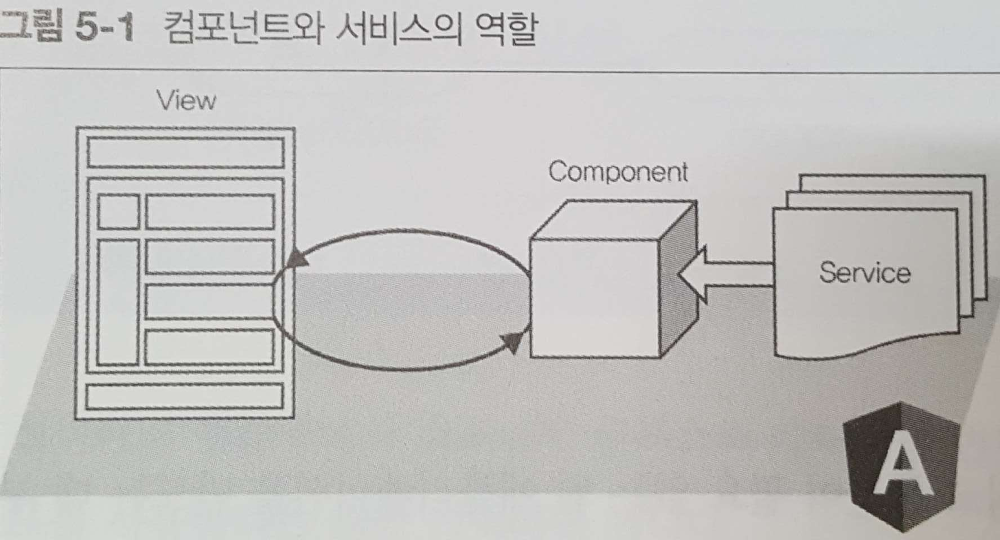

5 견고한 애플리케이션 만들기
======================

>    - 재사용 가능한 로직 서비스의 개념
>    - 의존성 주입의 개념과 활용 방법
>    - 테스트로 애플리케이션을 견고하게 만드는 방법
>    - 크롬 개발자 도구를 사용한 디버깅 방법


## 5.1 서비스


### 컴포넌트에 뷰의 로직과 비즈니스 로직이 공존하는 상황은 전형적인 안티패턴이다.
 * 뷰: 보여지는 화면
 * 컴포넌트: 뷰와의 상호작용을 관리하는 역할
 * 서비스: 뷰를 다루는데 관련되지 않은 로직은 모두 서비스


## 5.2 의존성 주입
### 필요한 시점에 이미 정의된 의존성을 주입 받아 동일한 인스턴스를 사용한다.

```javascript
//app.module.ts

@NgModule({
  declarations: [...],
  imports: [...],
  providers: [
    MySpecialLoggerService
  ],
  bootstrap: [AppComponent]
})
export class AppModule { }
```

### 5.2.1 Injectable, Inject
```javascript
@Injectable()
export class MySpecialLoggerService extends LoggerService {
  logs: string[] = [];
  private readonly MAX_HISTORY_CNT: number = 100;
  private readonly TIME_FORMATTER: string = "YYYY-MM-DD HH:mm:ss.SSS";

  constructor( @Inject(LOG_LEVEL_TOKEN) logLevel: LogLevel) {
    super(logLevel);
  }
}
```

### 5.2.2 providers
```javascript
//app.module.ts

@NgModule({
  declarations: [...],
  imports: [...],
  providers: [
    MySpecialLoggerService,{ provide: LOG_LEVEL_TOKEN, useValue: LogLevel.INFO }
  ],
  bootstrap: [AppComponent]
})
export class AppModule { }
```

### 5.2.3 의존성 주입기 트리
```javascript
@Component({
  ...
  providers: [MySpecialLoggerService, { provide: LOG_LEVEL_TOKEN, useValue: LogLevel.DEBUG }]
})
export class MouseTrackZoneComponent { }
```

## 5.3 테스트 코드 작성
#### 앵귤러 CLI 기반프로젝트는 테스트를 위한 기본 설정을 갖추고 있다
 * 카르마 (https://karma-runner.github.io/1.0/index.html)
  = 작성한 테스트 코드를 브라우저에서 실행하여 뷰와 이벤트에 대한 테스트를 진행한다. 
  
 * 자스민 (https://jasmine.github.io/2.4/introduction)
  = 카르마의 실행 환경 위에서 테스트 코드를 작성한다 (행동 주도 개발 프레임워크)   
   
