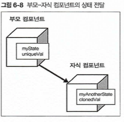
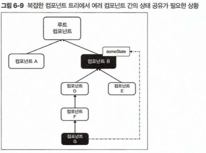
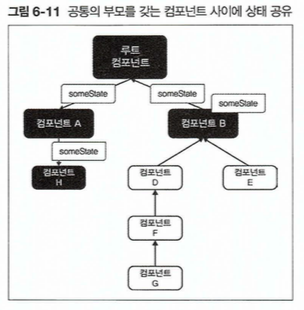
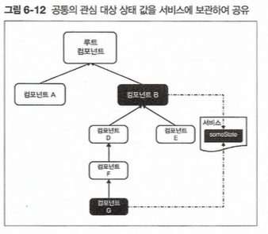
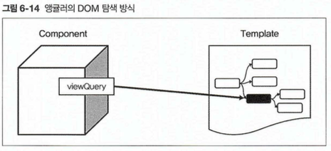
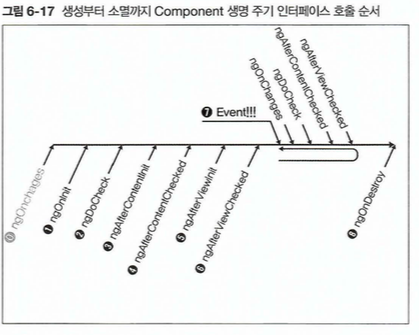

# CH06. 컴포넌트 고급

* 컴포넌트가 독립된 요소로서 사용되도록 하는 웹 컴포넌트
* 앵귤러에서 컴포넌트 개발 시 반드시 피하여야할 안티패턴
* 컴포넌트 간의 데이터를 공유하는 다양한 방법
* 앵귤러 방식으로 DOM을 탐색하고 조회하는 방법
* 컴포넌트의 생명 주기


컴포넌트는 앵귤러 시스템 안에서 ***독립된 스코프를 가진 하나의 완결된 뷰***를 그리는 요소라고 정의할 수 있다.


### 6.1 독립된 요소 : 컴포넌트

#### 6.1.1 웹 컴포넌트

##### DOM이란?

> 문서 객체 모델(The Document Object Model, 이하 DOM)은 HTML, XML 문서의 프로그래밍 interface 이다. DOM은 문서의 구조화된 표현(structured representation)을 제공하며 프로그래밍 언어가 DOM 구조에 접근할 수 있는 방법을 제공하여 그들이 문서 구조, 스타일, 내용 등을 변경할 수 있게 돕는다. DOM은 구조화된 nodes와 property와 method를 갖고 있는 objects로 문서를 표현한다. 이들은 웹 페이지를 스크립트 또는 프로그래밍 언어들에서 사용될 수 있게 연결시켜주는 역할을 담당한다.
>
> [더 자세한 내용 보기(출처)](https://developer.mozilla.org/ko/docs/Gecko_DOM_Reference/소개)

   #####    웹컴포넌트란?

> HTML이 기본으로 제공하는 엘리먼트는 브라우저와 운영체에제 따라 다르게 보이는 경우도 있고, 더 발전하는 웹 환경에 대응하기에 한계가 있습니다. 이런 한계를 JavaScript 컴포넌트로 보완하고 있습니다. 그러나 JavaScript 컴포넌트는 사용이 어려울 뿐만 아니라 크기가 커서 실행 속도가 느립니다. W3C(World Wide Web Consortium)에서는 이러한 문제를 개선하고자 웹 컴포넌트(Web Component)라는 명세(Specification)를 만들었습니다
>
> [더 자세한 내용 보기(출처)](http://d2.naver.com/helloworld/188655)

* 참고 : [Web Component 표준의 현재 상황(2015.8)_기술블로그](http://hacks.mozilla.or.kr/2015/08/the-state-of-web-components-web-component/)
* 참고 : [웹컴포넌트 공식사이트-introduction](https://www.webcomponents.org/introduction)

앵듈러에서 컴포넌트는 모든 정보를 갖춘 하나의 독립된 존재, **브라우저에서는 사용자가 바라보는 페이지를 기준으로 동작**. 

###### 웹컴포넌트

웹브라우저에서 컴포넌트 단위로 독립된 스코프의 UI를 개발할 수 있도록 하기 위한 표준

* Custom Elements : 브라우저 안에서 HTML 표준에 명시되지 않은 요소의 작성과 관련된 스펙
* HTML Imports : HTML 페이지 안에서 다른 HTML을 불러올 수 있는 스펙
* Template : 화면에 바로 렌더링되지 않지만 동적으로 렌더링할 수 있는 template요소를 정의한 스펙
* Shadow DOM : DOM 트리 내에 독립된 환경의 새로운 DOM 트리를 구축하여 자식 요소로 포함시킬 수 있는 기술

*웹컴포넌트의 스펙을 앵귤러의 컴포넌트가 완벽하게 따르는 것은 아님.*


#### 6.1.2 컴포넌트와 스타일 정보

컴포넌트에 스타일 정보를 선언하는 방법은 @Component 데코레이터의 **styles에 CSS를 인라인으로 직접 기술**하거나 **styleUrls로 외부 CSS 파일에 선언**할 수 있다. 역할별 로직을 가능한 분리하기 위해 외부 CSS에 선언하고 styleUrls에 작성하는 것이 좋다.

##### 앵귤러가 컴포넌트 스코프를 관리하는 방법

5장의 마우스 위치로거(ch-5/mouse-pos-logger)를 실행한 후 요소 검사를 통하여 MouseTrackZoneComponent가 선언 된 것을 살펴보면 _nghosts-c1 과 같이 앵귤러가 임의로 속성을 추가한다.

앵귤러에서 각 DOM에 고유한 속성을 부여해서 컴포넌트를 스코프로 국한하여 스타일 정보가 적용될 수 있도록 해 준다.

##### Shadow Dom 이용하기

```typescript
import { ViewEncapsulation } from '@angular/core';

@Component({
  encapsulation: ViewEncapsulation.Native
})
```


#### 6.1.3 컴포넌트의 독립성을 깨뜨리는 안티패턴

브라우저는 사용자가 보는 페이지기준으로 동작하므로 DOM API를 사용하여 컴포넌트에 직접 접근할 수 있다.

##### DOM API를 사용할 때 발생되는 문제

1. 뷰에 대한 의존도가 높아지고, 뷰의 로직을 테스팅하는 것이 어려워진다.
2. 컴포넌트 간의 결합도가 높아져서 변경사항이 발생하면 서로 영향을 주게 된다.

가급적 DOM API를 사용하여 접근하지 않고 앵귤러에서 제공하는 방법으로 DOM에 접근하는 것이 좋다.


### 6.2 컴포넌트 간 상태 공유와 이벤트 전파

##### 실습하면서...

1. 예제 6-17에서 getCheckedItemRatioText()는 변경되야 한다.

   ```typescript
   getCheckedItemRatioText() {
       const curCnt = this.checkList.filter(i => i.isChecked).length;
       const totalCnt = this.checkList.length;
       const roundedRatio = Math.round((curCnt / totalCnt) * 100);
       return `${roundedRatio}%`;
   }
   ```

2. CheckListStatisticsService는 CheckListDataService의 오탈자인 것 같다.

   * 예제 6-19
   * 예제 6-23

3. 중간에 생략된 부분이 있는지 책만 따라하면 진행이 안된다.

#### 6.2.1 부모-자식 컴포넌트 간의 통신

부모 컴포넌트는 자신의 템플릿에 선언된 자식 컴포넌트에 프로퍼티 바인딩과 이벤트 바인딩을 적용할 수 있다.



##### Input 데코레이터를 사용한 프로퍼티 바인딩

1. 부모 컴포넌트 구현

   자식 컴포넌트의 메타데이터에 선택자가 test-child로 선언되어 있을 경우 아래와 같이 프로퍼티 바인딩으로 전달할 수 있다.

   ```html
   <test-child [myAnotherState]="myState" [CloneVal]="uniqueVal"></test-child>
   ```

2. 자식 컴포넌트에서 구현

   ```typescript
   import { Component, Input } from '@angular/core';

   @Component({ ... })
   export class TestChildComponent {
     @Input() myAnotherState;
     @Input() cloneVal;
     
     constructor() {}
   }
   ```


##### Output 데코레이터를 사용한 이벤트 바인딩

자식 컴포넌트의 상태 정보를 부모 컴포넌트에 전달할 때 이벤트 바인딩을 사용한다.

###### EventEmitter 

*Visual Studio Code에서 해당 클래스에 접근하면 정의와 예제를 볼 수 있다.*

이벤트를 발생시키는 클래스

> Use by directives and components to emit custom Events.
>
> 지시자와 컴포넌트에서 맞춤 이벤트를 발생시킬 때 사용한다.

>  Emit : (빛・열・가스・소리 등을) 내다[내뿜다], 


1. 자식 컴포넌트에서 @Output(), EventEmitter 추가

   ```typescript
   // import 추가 : Output, EventEmitter 
   import { Component, Input,Output , EventEmitter } from '@angular/core';

   @Component({ ... })
   export class TestChildComponent {
     @Input() myAnotherState;
     @Input() cloneVal;
     // Output 데코레이터 추가
     @Output() onChangeChildData = new EventEmitter<number>();
     
     constructor() {}
     changeMyData() {
      // 비지니스 로직
      const resultVal = 8712;
      this.onChangeChildData.emit(resultVal);
     }
   }
   ```


2. 부모 컴포넌트에서 이벤트 바인딩으로 상태 전달받기

   자식컴포넌트에서 @Output데코레이터와 EventEmitter로 선언한 **onChangeChildData** 이벤트 바인딩으로 상태를 전달 받는다.

   ```typescript
   import { Component, Input,Output , EventEmitter } from '@angular/core';

   @Component({
     template:`<test-child [myAnotherState]="myState"
   	[clonedVal]="uniqueVal" (onChangeChildData)="receiveData($event)"></test-child>`
   })
   export class TestParentComponent {
     myState;
     uniqueVal;
     
     constructor() {}
     
     receiveData(resultVal) {
       console.log(`자식 컴포넌트로부터 전달된 데이터: ${resultVal}`);
     }
   }
   ```


#### 6.2.2 실습: 컴포넌트 통신v2

*  (ch6-3):[http://bit.ly/hb-af-ch6-3](http://bit.ly/hb-af-ch6-3)


*  (ch6-4):[http://bit.ly/hb-af-ch6-4](http://bit.ly/hb-af-ch6-4)
*  (ch6-5):[http://bit.ly/hb-af-ch6-5](http://bit.ly/hb-af-ch6-5)	


#### 6.2.3 다양한 상태 공유 시나리오

애플리케이션이 복잡해지면 컴포넌트 트리가 깊어지고 이러한 환경에서 부모-자식 관계를 넘어서 상태를 공유할 상황이 쉽게 발생한다. 


컴포넌트G의 변경상황이 컴포넌트B의 someState까지 전달되어야 하는경우 아래와 같은 계층도를 볼 수 있다.




[그림 6-10]과 같이 컴포넌트B에서 컴포넌트G까지 순차적으로 프로퍼티 바인딩하면 someState의 정보와 함계 변경 사항이 일어날 때 컴포넌트G까지 전달된다.




[그림6-11]과 같이 컴포넌트H에게 컴포넌트B의 상태가 필요한 경우 루트 컴포넌트까지 이벤트 바인딩으로 상태를 전달한 후 루트컴포넌트에서 컴포넌트H까지 프로퍼티 바인딩을 사용하면 상태를 공유할 수 있다.

**멀리 떨어진 두 컴포넌트가 상태를 공유하기 위해서 공유할 상태에 관심이 없는 컴포넌트에도 불필요한 상태가 전달되어 불편하다.**


#### 6.2.4 싱글턴 서비스를 이용한 상태 공유

멀리 떨어진 컴포넌트 간에 상태를 공유하기 위하여 여러 컴포넌트를 통하지 않아도 되는 방법.

서비스를 활용하면 여러 컴포넌트를 통과할 필요 없이 [그림6-12]와 같이 바꿀 수 있다.



1. 서비스 추가

   ```
   ng g service check-list-data
   ```

2. AppModule에서 선언하기

   ```typescript
   // AppModule
   @NgModule({
     ...
     providers: [CheckListDataService]
   })
   ```

3. 컴포넌트에서 서비스 전달받기

   ```typescript
   import { CheckListDataService } from '../../check-list-data.service';

   @Component({
     ...
   })
   export class ResultGraphComponent implements OnInit {
     ...
     
     /* 생성자 파라미터에 서비스를 선언하면 
      * AppModule에서 선언한 providers를 통해 의존성을 주입받아서
      * this.checkListDataService의 형태로 서비스에 접근이 가능하다.
     */
     constructor(public checkListDataService: CheckListDataService) { }
     
     ...
              
     /*
      * 다른 컴포넌트에 전달할 값을 서비스를 통해 전달한다.
     */
     onChangeCnt(op: string) {
       this.checkListDataService.changeTotalCntByOp(op);
     }
   }
   ```

4. EventEmitter를 활용하여 이벤트 바인딩으로 값을 전달하기

   ```typescript
   import { EventEmitter } from '@angular/core';

   @Injectable()
   export class CheckListDataService {
     ...
     // EventEmitter를 선언한다.
     changedCntState: EventEmitter<any> = new EventEmitter<any>();
     
     ...
     checkItem(checkItem: CheckItem) {
       this.checkList[checkItem.idx-1] = checkItem;
       // 상태의 변경이 일어났다는 것을 전달한다.
       this.changedCntState.emit({});
     }
   }
   ```

5. 이벤트를 받아서 처리할 수 있도록 Component를 개선

   ```typescript
   ngOnInit() {
     this.CheckListDataService.changedCntState.subscribe(() => this.printGraph());
   }
   ```


> EventEmitter는 사실 RxJS 라이브러리 덕분에 이벤트 바인딩의 매개체로 사용할 수 있었다. RxJS는 앵귤러에서 비동기 이벤트를 선언적으로 처리하기 위하여 사용하고 있다.
>
> **RxJS는 7장에서 자세하게 다룬다.**


### 6.3 앵귤러 방식의 템플릿 요소 탐색

앵귤러가 제공하는 DOM 탐색 특징

1. DOM 탐색의 대상은 자신의 컴포넌트 내에 선언된 템플릿에만 한정된다.
2. 탐색된 DOM 요소 결과도 브라우저의 표준 DOM객체가 아닌 DOM객체를 감싼 ElementRef라고 하는 타입의 객체를 반환한다.

> 화면을 배치하고 조정하는 실질적인 작업은 앵귤러가 도맡아 하고 개발자는 컴포넌트와 템플릿의 선언적 방식의 코딩과 앵귤러가 제공하는 감싸진 DOM 요소를 사용하므로 직접 DOM을 다루는 일을 원천적으로 제거하는 것이 목표.


템플릿의 특정요소에 접근하려면 컴포넌트에 찾고자 하는 뷰의 요소 정보와 함께 탐색한 결과를 바인딩할 변수를 선언해야 한다.




#### 6.3.1 ViewChild를 사용한 요소 탐색

ViewChild를 사용하여 부모 컴포넌트에서 자식 컴포넌트의 공개된 속성이나 메서드를 사용할 수 있다.

```typescript
import { Component, ViewChild } from '@angular/core';

@Component({
  ...
})
export class TestParentComponent {
	@ViewChild(TestChildComponent) testChild: TestChildComponent;

  	//testChild를 통해 자식컴포넌트의 공개된 속성이나 메소드를 사용할 수 있다.
}
```

1. ViewChild

   인자로 전달된 탐색 조건에 해당하는 요소 가운데 첫 번째 결과를 바인딩

2. ViewChildren

   탐색 조건에 해당하는 모든 결과를 QueryList라는 타입으로 바인딩

* 예제 : [http://bit.ly/hb-af-view-child](http://bit.ly/hb-af-view-child) 

#### 6.3.2 템플릿 참조 변수와 ElementRef

네이티브 DOM요소를 탐색하는 방법

1. ElementRef 주입

   ```typescript
   import { Component, ElementRef } from '@angular/core';

   @Component({
     ...
   })
   export class AppComponent {
     elementRef: ElementRef;
     
     constructor(ef: ElementRef) {
       this.elementRef = ef;
     }
   }
   ```

2. 템플릿 참조 변수 선언

   탐색할 DOM 요소를 지칭할 임의의 변수명에 접두어로 ***#*** 또는 ***ref-*** 를 붙인 후 요소의 속성으로 선언한다. 

   * 템플릿에서 속성을 선언

   ```html
   <div>
   	<input type="text" id="n-1" #myInput />
   	<input type="text" id="n-2" ref-myInput />
   <div>
   ```


*    컴포넌트에서 선언하여 사용(ViewChild, ViewChildren, ElementRef)

   ```typescript
   import { Component, ViewChild, ViewChildren, ElementRef
           , QueryList, AfterViewInit } from '@angular/core';

   @Component({
     ...
   })
   export class AppComponent implements AfterViewInit {
     @ViewChild('myInput') myInput: ElementRef;
     @ViewChildren('myInput') myInputs: QueryList<ElementRef>;

     ngAfterViewInit() {
       //이때 바인딩이 이루어짐
     }
              
   }
   ```

   * 주의할 점
     * 동일한 이름으로 템플릿의 루트 레벨에 템플릿 참조 변수를 중복선언하면 컴파일 에러가 발생한다.
     * 템플릿 참조 변수와 ViewChild, ViewChildren을 사용하여 바인딩한 속성은 ngAfterViewInit 메서드가 실행되는 시점부터 확인할 수 있다.
     * 템플릿 참조 변수는 선언된 템플릿 안에서 직접 사용할 수도 있다. 
       * 예제 : [http://bit.ly/hb-af-tpl-ref](http://bit.ly/hb-af-tpl-ref) 


#### 6.3.3 Content Projection과 ContentChild를 사용한 요소 탐색

##### ContentProjection

컴포넌트의 태그안에 다른 요소나 컴포넌트 태그 등을 작성하는 것.

부모컴포넌트에서 추가로 삽입할 요소를 컴포넌트 태그 사이에 삽입한다

```
<div style="background-color:yellow;"> 
      <h4>In AppComponent's tpl</h4>
      <test-parent>
        <div style="background-color: red;">
          <h4>In AppComponent's content projected tpl</h4>
        </div>
        <test-child></test-child>
      </test-parent>
   </div>
```

자식 컴포넌트에서 부모 컴포넌트에서 삽입한 요소를 사용하려면 <ng-content>태그를 선언해야 한다.

```html
<div style="background-color: grey;">
      <h4>In ParentComponent's tpl</h4>
      <ng-content></ng-content>
</div>
```

##### ContentChild, ContentChildren

Content Projection으로 전달된 템플릿의 DOM을 탐색할 때 사용할 수 있는 데코레이터

ViewChild, ViewChildren과 기능과 역할이 동일하지만, DOM 탐색의 대상이 자신의 템플릿인지 Content Projection으로 전달된 템플릿인지만 다르다.

* 예제 : [http://bit.ly/hb-af-content-projection](http://bit.ly/hb-af-content-projection) 


> Content Projection과 ContentChild 데코레이터를 사용하면 부모-자식 컴포넌트간에 강한 결합이 형성되어 변경사항이 발생 시 같이 변경해야 한다. 따라서 가능하면 사용하지 않음으로써 컴포넌트 간의 불필요한 종속성을 제거하는 것이 좋다.
>
> ContentChild로 탐색한 결과가 반드시 필요한 대상이 아닌 선택적으로 사용할 수 있는 경우라면 괜찮다.


### 6.4 컴포넌트 생명 주기




| 설명                    | 생명주기                                     |
| :-------------------- | :--------------------------------------- |
| ngOnInit              | 컴포넌트의 생성을 의미하는 생명 주기                     |
| ngOnDestroy           | 컴포넌트가 뷰에서 제거되기 직전에 호출된다                  |
| ngAfterContentInit    | 뷰가 초기화 되는 시첨에 호출, 컴포넌트로 전달받은 템플잇의 초기화 완료시점 |
| ngAfterViewInit       | 뷰가 초기화 되는 시첨에 호출, 컴포넌트의 템플릿이 완전히 초기화된 시점 |
| ngOnChanges           | ngOnChanges는 컴포넌트의 구현에 따라 초기에 선택적으로 호출되는 생명주기, 컴포넌트가 프로퍼티 바인딩을 통하여 부모 컴포넌트에게 상태를 전달받는 경우에만 호출된다. |
| ngDoCheck             | 컴포넌트의 상태 변경을 감지한 후에 항상 호출되는 메서드, OnInit이 호출된 뒤에 바로 호출되고, 이후에는 이벤트에 따라 상태 변경 감지가 내부에서 실행된 후에 항상 호출된다. |
| ngAfterContentChecked | ngAfterContentInit이 호출된 뒤에 연달아 호출된 뒤, 외부 이벤트가 발생할 때마다 앵귤러가 상태 변경을 체크한 후 호출된다. |
| ngAfterViewChecked    | ngAfterViewInit이 호출된 뒤에 연달아 호출된 뒤, 외부 이벤트가 발생할 때마다 앵귤러가 생태 변경을 체크한 후 호출된다. |


#### 6.4.1 ngOnInit과 ngOnDestroy

* 예제 : [http://bit.ly/hb-af-ng-oninit](http://bit.ly/hb-af-ng-oninit) 

#### 6.4.2 ngAfterContentInit과 ngAfterViewInit

#### 6.4.3 ngOnChanges

* 예제 : [http://bit.ly/hb-af-ng-changes](http://bit.ly/hb-af-ng-changes) 

#### 6.4.4 ngDoCheck

* 예제 : [http://bit.ly/hb-af-do-check](http://bit.ly/hb-af-do-check) 

#### 6.4.5 ngAfterContentChecked와 ngAfterViewChecked


#### 6.4.6 지시자의 생명주기

지시자는 기본적으로 컴포넌트와 생명주기가 동일하다.

지시자는 컴포넌트와 달리 화면에 노출할 뷰를 가지지 않기 때문에, 뷰의 상태와 관련된 생명주기는 사용할 필요가 없다.


> **뷰와 관련된 생명주기**
>
> AfterViewInit, AfterViewChecked, AfterContentInit,AfterContentChecked

> **지시자에서 활용할 생명주기**
>
> OnChanges, DoCheck, OnInit, OnDestroy


